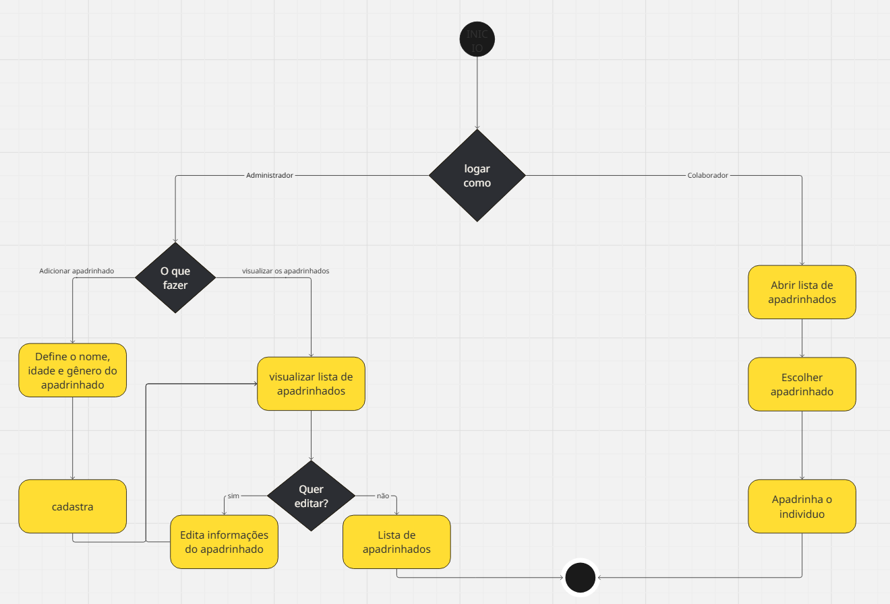
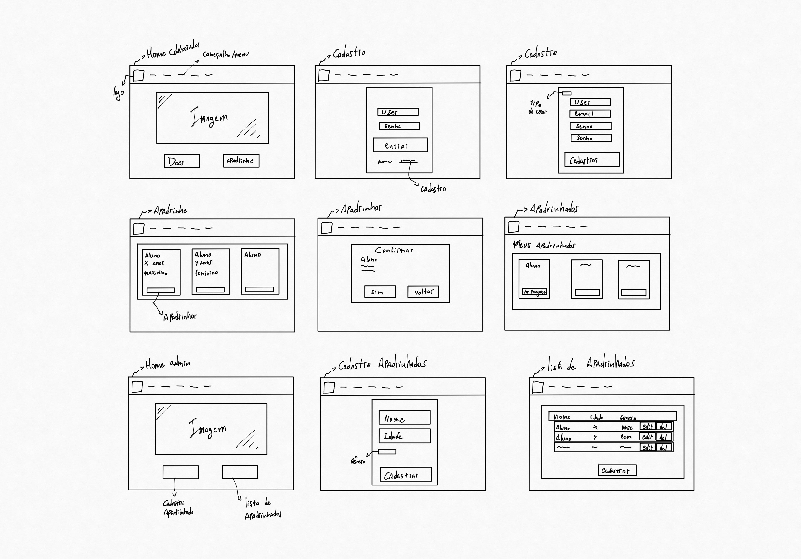
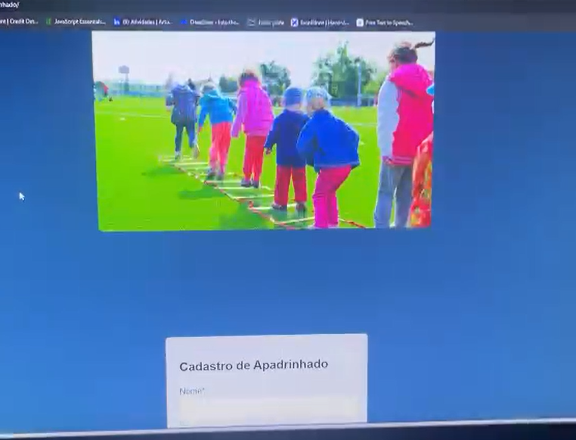
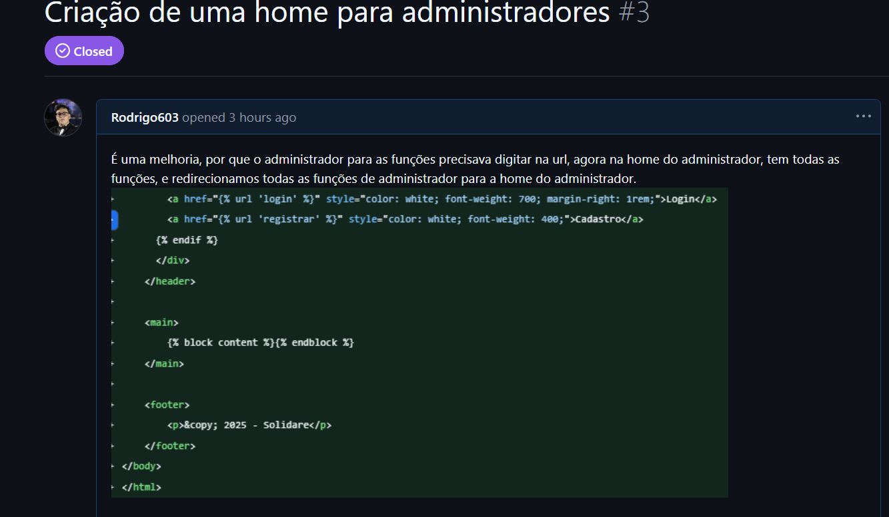
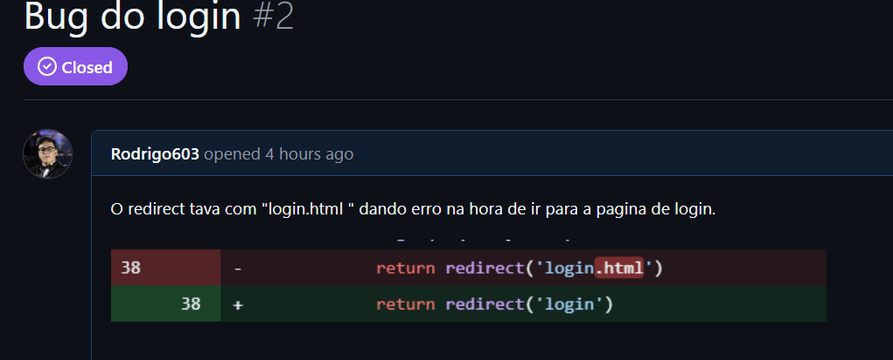
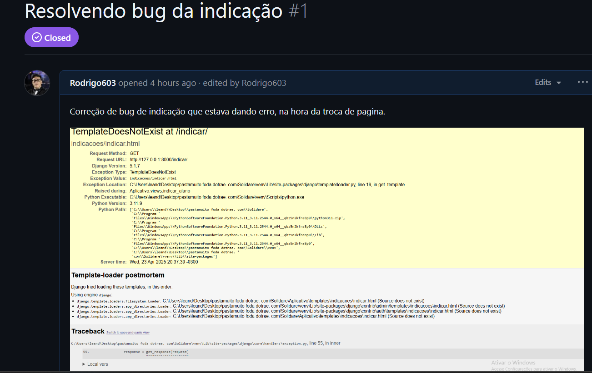

# Crescer juntos
## Descrição
Aplicação web do programa de apadrinhamento dos alunos do Projeto Alvo Certo, programa da Instituição Solidare.

## 📎Links importantes

  
  

## Tecnologias usadas
- **Backend:** Python (Django)
- **Frontend:** HTML e CSS

## 👥 Equipe de Desenvolvimento

👨‍💻 Rodrigo José Dantas de Oliveira - rjdo@cesar.school - CC

👨‍💻 Leandro Veras Padilha Filho - lvpf@cesar.school - CC

👨‍💻 Artur Antunes de Souza - aas4@cesar.school - CC

👨‍💻 Gustavo Pedrosa - gpm@cesar.school - CC

👨‍💻 Cassiano Filho - crdmcf@cesar.school - CC

👨‍💻 Marco Antonio Veras - mavss@cesar.school - CC

👨‍💻 Ricardo Machado -  rmvl@cesar.school - CC

👨‍💻 Thiago Alves -  tam7@cesar.school - CC

👨‍💻 Júlia Ferreira -   jvf@cesar.school - CC

👨‍💻 João Pedro Braga - jpvscb@cesar.school -Design

👨‍💻 Karina Bandeira - krb@cesar.school - Design

👨‍💻 Maria Fernanda Avellar - mfaa@cesar.school - Design
 

## Entregas 

  
✅Status report 1

   
   ## Histórias implementadas
   ### História  nº 1: Cadastrar apadrinhados.
   
   Como administrador do sistema,quero poder cadastrar novos apadrinhados preenchendo informações obrigatórias,Para que eles sejam incluídos corretamente na lista de apadrinhados e possam ser acompanhados pelos colaboradores.
 
   **Cenario 1** :
   **Dado** que o administrador preenche todos os campos obrigatórios corretamente (ex: nome, data de nascimento, gênero,etc.)
    
   **Quando** ele clicar em "Cadastrar"
    
   **Então** o sistema deve salvar o novo apadrinhado com sucesso, exibir uma mensagem de confirmação: “Apadrinhado cadastrado com sucesso” e  redirecionar ou atualizar a lista de apadrinhados.
   
   **Cenario 2**:
   **Dado** que o administrador deixa campos obrigatórios em branco (ex:    nome e data de nascimento)
   
   **Quando** ele clicar em "Cadastrar"
    
   **Então** o sistema deve bloquear o envio do formulário
    e exibir mensagens de erro em destaque informando os campos faltantes (ex: “O campo Nome é obrigatório”).
   ### História nº 2: Apadrinhamento de alunos.

   Como colaborador da instituição,
    quero visualizar a lista de alunos disponíveis para apadrinhamento,
    para que eu possa escolher um aluno e iniciar o processo de apadrinhamento.

   **Cenario 1**:
   **Dado** que estou logado no sistema como colaborador,
   
   **Quando** acesso a funcionalidade de apadrinhamento,
   
   **Então** devo ver uma lista com todos os alunos disponíveis, exibindo nome, idade e status de apadrinhamento.

   **Cenario 2**:
   **Dado** que estou visualizando a lista de alunos disponíveis,
    
   **Quando** seleciono um aluno e clico em "Apadrinhar",
   
   **Então** o sistema deve registrar essa ação, atualizar o status do aluno para "Apadrinhado" e exibir uma confirmação para o colaborador.

   [Link para as Histórias](https://docs.google.com/document/d/1LhCymEJ4g4B4Pyp8Aw-aXz103KHfBuQ9wGO2JfETQUw/edit?tab=t.0)

   ## Screencast

   [Screencast do Crescer Juntos](https://youtu.be/zZW43oyfJPQ)

   ## Diagrama de atividades
   
   

   ## Deployment

   [Deploy do site Crescer Juntos](https://crescer-juntos.azurewebsites.net/)
    
   ## Relatório programação em par

   [Relatório](https://docs.google.com/document/d/10dt_6UkQ73hmhbcdxdvz087hH_v_gVox6J6LYE2CLsk/edit?tab=t.0)

   ## Sketches/storyboards
   
   

   ## Bugtracker
   

   

   

   

